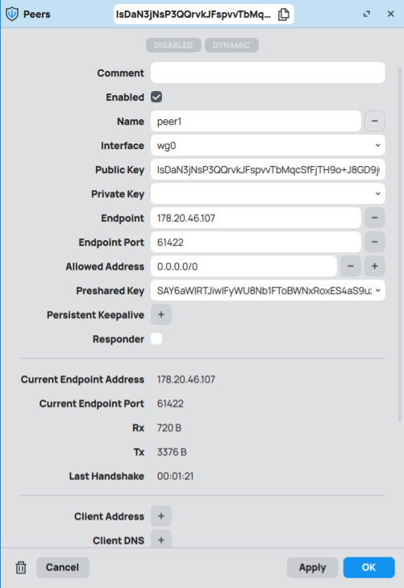
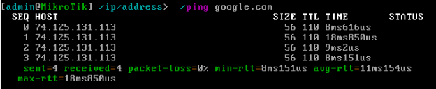

**Лабораторная работа №1 "Установка CHR и Ansible, настройка VPN"**

**University: [ITMO University](https://itmo.ru/ru/)  
Faculty: [FICT](https://fict.itmo.ru)  
Course: [Network programming](https://github.com/itmo-ict-faculty/network-programming)  
Year: 2024/2025  
Group: 34202  
Author: Хлынин Кирилл Дмитриевич: Lab1  
Date of create: 06.11.2024  
Date of finished: 06.11.2024**  

**Описание**

Данная работа предусматривает обучение развертыванию виртуальных машин (VM) и системы контроля конфигураций Ansible а также организации собственных VPN серверов.

**Цель работы**

Целью данной работы является развертывание виртуальной машины на базе платформы Microsoft Azure с установленной системой контроля конфигураций Ansible и установка CHR в VirtualBox

**Ход работы**

**По гайду от [Mikrotik](https://wiki.mikrotik.com/wiki/Manual:CHR_VirtualBox_installation) (<https://wiki.mikrotik.com/Wiki/Manual:CHR_VirtualBox_installation>) была установлена виртуальная машина на RouterOS в VirtualBox:**

Далее, был куплен сервер на хостинге VDSina для выполнения второй части работы:

На систему сервера был установлен python3 и Ansible:

Далее, был установлен Wireguard, созданы публичный и приватный ключ, а также файл конфигурации wg0.conf:

После чего интерфейс был поднят с помощью команды wg-quick up и systemctl start <wg-quick@wg0.service>:

Далее, со стороны клиента в WinBox был настроен интерфейс Wireguard, в котором был указан приватный ключ и порт доступа от интерфейса:

**Проверка работоспособности**

- Пинг с клиента на сервер:

- Доступ в интернет на клиенте:

- Пинг с сервера на клиент:

- Доступ в интернет на сервере:

**Вывод**

В результате работы была развернута виртуальная машина для роутера Mikrotik, которая соединяется Wireguard VPN туннелем с удаленным сервером в облаке.
