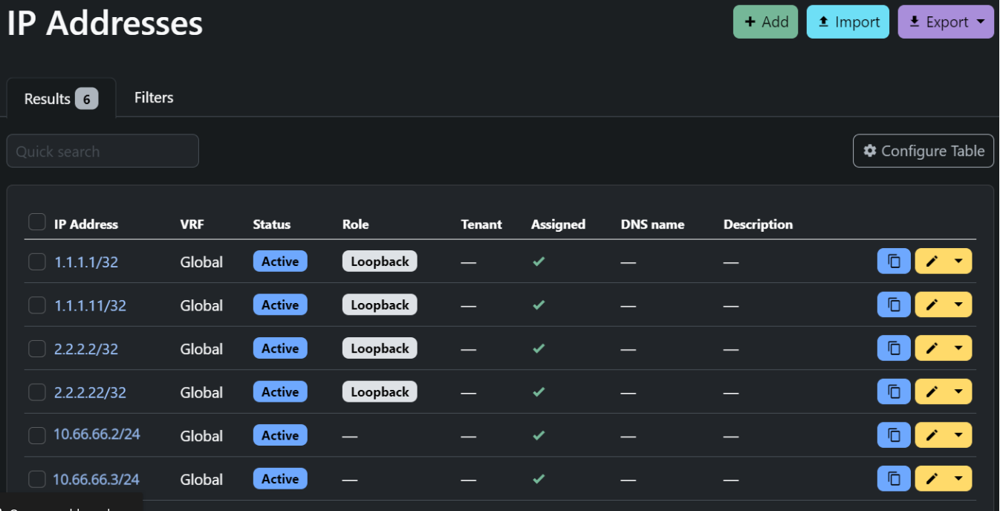
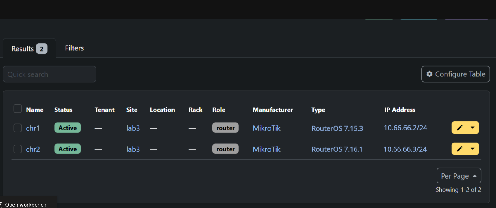
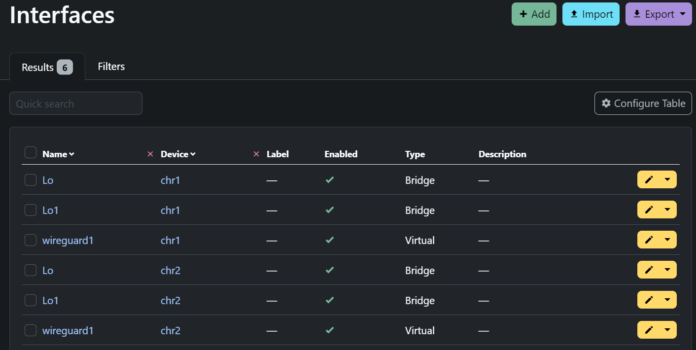
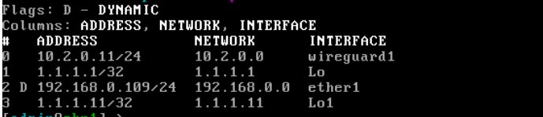
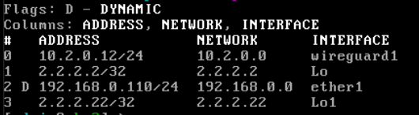
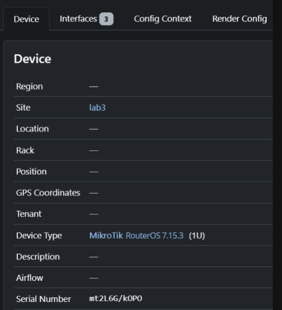
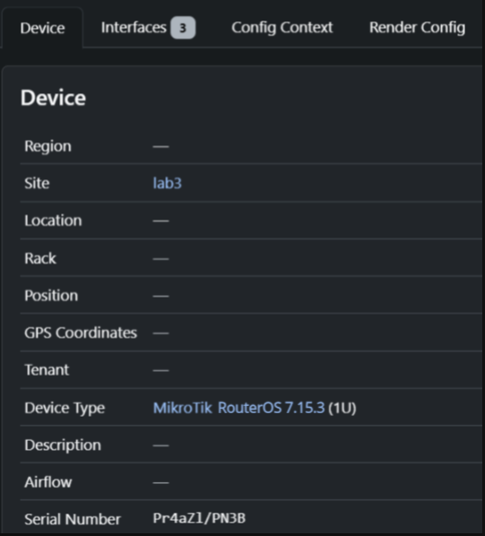

University: [ITMO University](https://itmo.ru/ru/)

Faculty: [FICT](https://fict.itmo.ru)

Course: [Network programming](https://github.com/itmo-ict-faculty/network-programming)

Year: 2024/2025

Group: K34202

Author: Хлынин Кирилл Дмитриевич

Lab: Lab2

Date of create: 08.12.2024

Date of finished: 08.12.2024

# Отчет по лабораторной работе №3 "Развертывание Netbox, сеть связи как источник правды в системе технического учета Netbox"

**Цель работы:** с помощью Ansible и Netbox собрать всю возможную информацию об устройствах и сохранить их в отдельном файле.

**Ход работы:**

1. Поднимем NetBox на виртуальной машине Ubuntu 22.04 c помощью докер-компоуз файла найденного на [просторах интернета](https://github.com/netbox-community/netbox-docker/tree/release).

```bash
root@hollie:~/Desktop/lab3/netbox-docker$ sudo docker-compose up -d
[sudo] password for root:
Starting netbox-docker_postgres_1      ... done
Starting netbox-docker_redis_1          ...done
Starting netbox-docker_redis-cache_1    ...done
Starting netbox-docker_netbox_1        ... done
Starting netbox-docker_netbox-housekeeping_1    ...done
Starting netbox-docker_netbox-worker_1  ...done
```
Теперь в браузере по адресу https://158.160.150.209/ (белый ip-адрес виртуальной машины) доступен NetBox:


2. Заполним информацию о CHR в NetBox. Были добавлены ip-адреса, устройства и интерфейсы:



!




3. Используя Ansible и роли для NetBox, сохраним все данные из NetBox в отдельный файл:

```
plugin: netbox.netbox.nb_inventory
api_endpoint: https://158.160.150.209
token: токен
validate_certs: False
config_context: False
group_by:
  - device_roles
interfaces: True
```
git config user.name "khlinin31"
git config user.email "khlinin9874123@gmail.com"


Данные были сохранены в файл [nb_inventory_res.yml](./yaml/nb_inventory_res.ymlnb_inventory_res.yml):

```
ansible-inventory -v --list -i nb_inventory.yml --yaml > nb_inventory_res.yml
```

В файл были также добавлены общие переменные.

4. Напишем сценарий, при котором на основе данных из NetBox (nb_inventory_res.yml) можно настроить 2 CHR (изменить имя устройства, добавить IP-адрес на устройство):

```
- name: Config CHRs
  hosts: device_roles_router
  tasks:
    - name: Set Device Name
      community.routeros.command:
        commands:
          - /system identity set name="{{interfaces[0].device.name}}"
    - name: Add IP
      community.routeros.command:
        commands:
        - /interface bridge add name="{{interfaces[1].name}}"
        - /ip address add address="{{interfaces[1].ip_addresses[0].address}}" interface="{{interfaces[1].name}}"
```

Запускаем плейбук:

```
ansible-playbook -i nb_inventory_res.yml lab31.yml
```

Проверяем изменения на chr1:



И также на chr2:




5. Напишем сценарий, позволяющий собрать серийный номер устройства и вносящий серийный номер в NetBox:

```
- name: Collect Serial Numbers To NetBox
  hosts: device_roles_router
  tasks:
    - name: Collect Serial Numbers
      community.routeros.command:
        commands:
          - /system license print
      register: license
    - name: Collect Names
      community.routeros.command:
        commands:
          - /system identity print
      register: identity
    - name: Add Serial Number to Netbox
      netbox_device:
        netbox_url: https://158.160.150.209
        netbox_token: токен
        data:
          name: "{{identity.stdout_lines[0][0].split(' ').1}}"
          serial: "{{license.stdout_lines[0][0].split(' ').1}}"
        state: present
        validate_certs: False
```

Запускаем плейбук и проверяем данные в NetBox:

```
ansible-playbook -i nb_inventory_res.yml lab32.yml
```


CHR1:



CHR2:




**Вывод:** При выполнении работы были получены навыки по выгрузке конфигов роутеров с помошью Ansible и NetBox. 