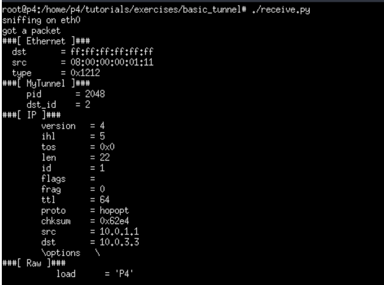

University: [ITMO University](https://itmo.ru/ru/)

Faculty: [FICT](https://fict.itmo.ru)

Course: [Network programming](https://github.com/itmo-ict-faculty/network-programming)

Year: 2024/2025

Group: K34202

Author: Хлынин Кирилл Дмитриевич

Lab: Lab4

Date of create: 18.12.2024

Date of finished: 18.12.2024

# Лабораторная работа №4 "Базовая 'коммутация' и туннелирование используя язык программирования P4"


## Цель работы
Изучить синтаксис языка программирования P4 и выполнить 2 обучающих задания от Open network foundation для ознакомления на практике с P4.
## Ход работы:
### Клонирование репозитория
Был склонирован репозиторий p4lang/tutorials и установлены Vagrant и VirtualBox. 
Создана виртуальная машина с помощью команды vagrant up.


```bash
root@hollie:~$ vagrant --version
Vagrant 2.2.19
```

### Implementing Basic Forwarding
В данном задании нужно дополнить скрипт basic.p4, чтобы в сети заработала переадресация IP-пакетов.

Был выполнен вход под учетной записью p4/p4.

Была выполнена команда make run, а затем проверена доступность узлов.

С форвардингом явно что то не так:

```bash
mininet> pingall
*** Ping: testing ping reachability
h1 -> X X X
h2 -> X X X 
h3 -> X X X
h4 -> X X X
*** Results: 100% dropped (0/12 received)
```
Был изменен парсер, который теперь позволяет парсить заголовки ipv4 и затем продолжать принимать пакеты.

```
parser MyParser(
        packet_in packet,
        out headers hdr,
        inout metadata meta,
        inout standard_metadata_t standard_metadata
        ) {

    state start {
        packet.extract(hdr.ethernet);
		transition select(hdr.ethernet.ehterType) {
			TYPE_IPV4: parse_ipv4;
		}
    }
	
	state parse_ipv4 {
		packet.extract(hdr.ipv4);
		transition accept;
	}
}
```

Было дополнено action ip4_forward: был определен выходной порт, адрес назначения пакета, обновлен источник отправления пакета, уменьшено значение TTL.
```
control MyIngress(inout headers hdr,
                  inout metadata meta,
                  inout standard_metadata_t standard_metadata) {
    action drop() {
        mark_to_drop(standard_metadata);
    }

    action ipv4_forward(macAddr_t dstAddr, egressSpec_t port) {
        standard_metadata.egress_spec = port;
        hdr.ethernet.srcAddr = hdr.ethernet.dstAddr; // Меняем адрес на свой
        hdr.ethernet.dstAddr = dstAddr;
        hdr.ipv4.ttl = hdr.ipv4.ttl - 1; // Уменьшаем TTL
    }

    table ipv4_lpm {
        key = {
            hdr.ipv4.dstAddr: lpm;
        }
        actions = {
            ipv4_forward; 
            drop;
            NoAction;
        }
        size = 1024;
        default_action = NoAction();
    }

    apply {
        if(hdr.ipv4.isValid()){
          ipv4_lpm.apply();
        }
    }
```
Добавлен депарсер, который собирает поля в правильном порядке:

```
control MyDeparser(packet_out packet, in headers hdr) {
    apply {
        packet.emit(hdr.ethernet);
        packet.emit(hdr.ipv4);
    }
}
```
Теперь скрипт работает правильно. Результат пинга:

```bash
mininet> pingall
*** Ping: testing ping reachability
h1 -> h2 h3 h4
h2> h1 h3 h4
h3> h1 h2 h4
h4> h1 h2 h3
*** Results: 0% dropped (12/12 received)
```


### Implementing Basic Tunneling
Был изменен файл basic_tunnel.p4: 
Добавлена функция заполненения заголовка myTunnel в MyParser.
```
parser MyParser(packet_in packet,
                out headers hdr,
                inout metadata meta,
                inout standard_metadata_t standard_metadata) {

    state start {
        packet.extract(hdr.ethernet);
        transition select(hdr.ethernet.etherType) {
			TYPE_MYTUNNEL: parse_myTunnel;
            TYPE_IPV4 : parse_ipv4;
        }
    }

    state parse_ipv4 {
        packet.extract(hdr.ipv4);
        transition accept;
    }

	  state parse_myTunnel {
        packet.extract(hdr.myTunnel);
        transition select(hdr.myTunnel.proto_id) {
            TYPE_IPV4: parse_ipv4;
        }
    }
	
}
```

myTunnel_forward теперь назначает выходной порт.
```
// TODO: declare a new action: myTunnel_forward(egressSpec_t port)
	action myTunnel_forward(egressSpec_t port) {
        standard_metadata.egress_spec = port;
    }
```
Определена таблица myTunnel_exact.
```
 // TODO: declare a new table: myTunnel_exact
	table myTunnel_exact {
        key = {
            hdr.myTunnel.dst_id: exact;
        }
        actions = {
            myTunnel_forward;
            drop;
        }
        size = 1024;
        default_action = drop();
    }
```
Обновлено выражение apply, которое позволяет применять myTunnel_exact, если заголовок myTunell валидный.
```
apply {
        // TODO: Update control flow
        if (hdr.ipv4.isValid()) {
            ipv4_lpm.apply();
    }
```
Был изменен MyDeparser
```
control MyDeparser(packet_out packet, in headers hdr) {
    apply {
        packet.emit(hdr.ethernet);
        // TODO: emit myTunnel header as well
		packet.emit(hdr.myTunnel);
        packet.emit(hdr.ipv4);
    }
}
```
Локальная связность теперь есть.


```bash
mininet> pingall
*** Ping: testing ping reachability
h1 -> h2 h3
h2 -> h1 h3
h3 -> h1 h2
*** Results: 0% dropped (6/6 received)
```

Проверка скрипта, с h1 был оправлен пакет на h2 без туннелирования.


Был отправлен пакет с h1 с туннелированием.


И он долетел до h2!



Схема:


### Вывод

Были изучены основы языка программирования P4, предназначенные для организации процесса обработки сетевого трафика. Полученные знания применены на практике, написано 2 программы, позволяющие организовать в заранее созданной сети процессы перенаправления пакетов и туннелирования.